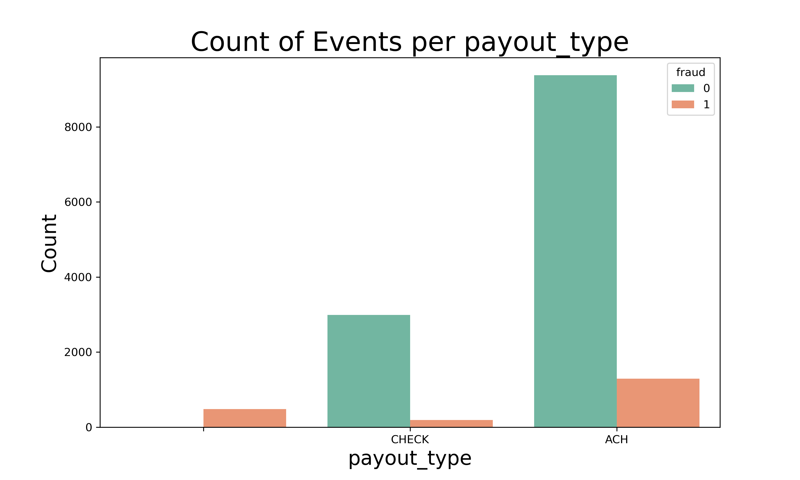
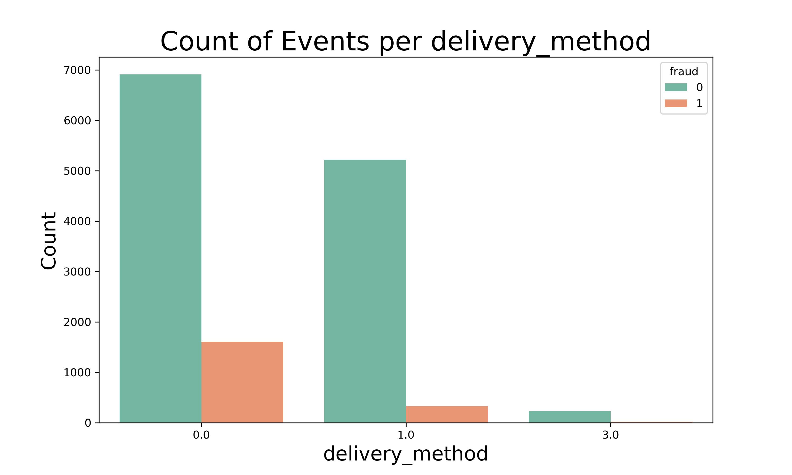
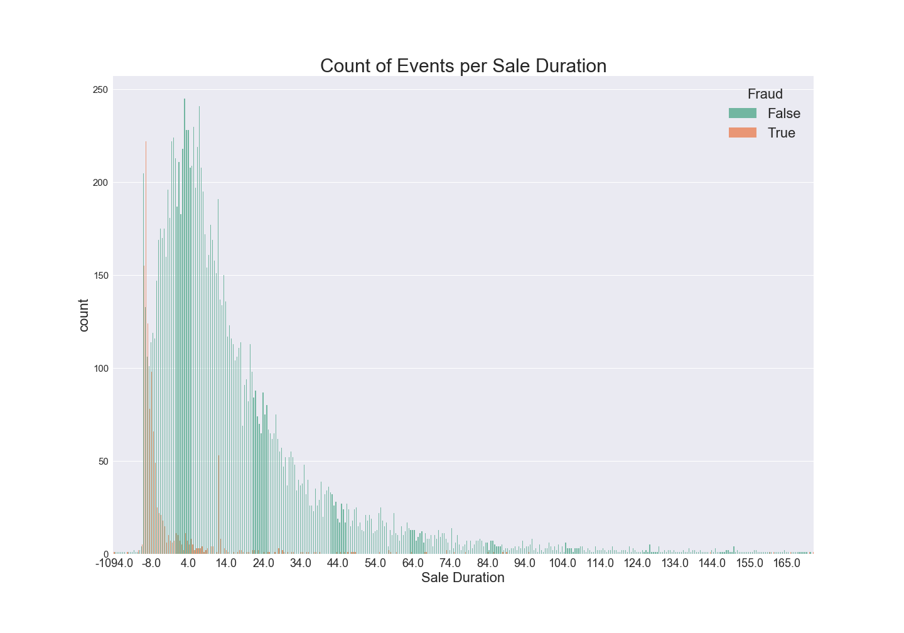
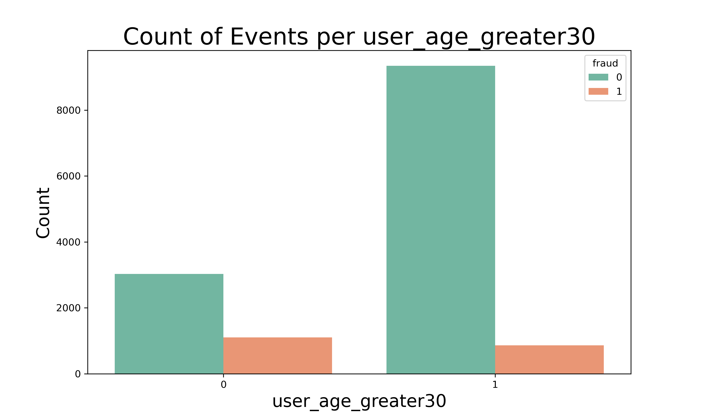
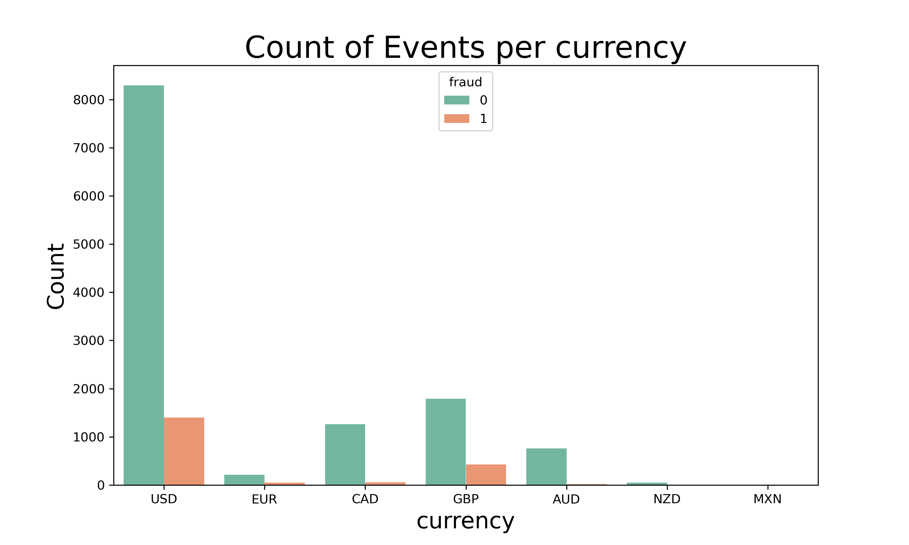
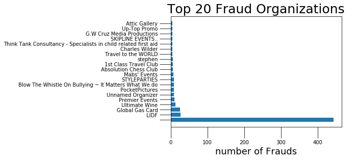

# Event Quality Control

## Background and Motivation
We have data from an online event website and based on the information included in the event description, user description, and post details, we must determine whether this event is Fraudulent or not. By increasing the number of correct Fraud identifications, we can retain customers' loyalty and trust, and hopefully gain new customers. 

## Data 

Each event is represented by about 45 different columns with details about the event and who is hosting the event. 

We cleaned up all the date columns from UNIX to human-readable, and converted some of the numerical columns to be 0 or 1 in order to see how they are distributed and if that distribution is indiciative of fraudulency. 

Cleanup organization description/event description using beautiful soup, NLP analysis

After some EDA (to follow), we decided to take a closer look at the following columns.
 - number of payouts (higher is more likely fraud)
 - currency (US/GBD)
 - delivery method (etickets coded as 0 are more likely to be fraud than paper tickets coded as 1)
 - sale duration and sale duration2(shorter more likely to be fraud)
 - payout type (if no listed payout type, fraud, nothing, check, ACH)
 - has analytics (if 1, not fraud)
 - facebook published (if 1, not fraud)
 - user age (the majority of users that are considered not fraud have an 'age' older than 30. Assumption is account length in days)
 - user type (types 1,3,4 have the most fraud activity)
 - channels (doesn't look super useful but could be good)

Account types used to create target: All types except "Premium" were classified as Fraud. This included accounts that were labelled spam or tos lock/warning which we are assuming means a Terms of Service lock or warning. 

## EDA

**Payout Type**

There are three catogories for the payout type: ACH (Automated clearing house), check and not-disclosed. Whats important to note is that, While ACH is the most used one, and contains the most fraudulent events, the non-disclosed payout type contains only fraudulent events. 

**Delivery method**

Most of the events used 0 and 1 for their delivery methods. 

**Sale duration**

The data for the sale duration  was listed from -1094 to 165.  Most of the fraudulent events took place when the sale duration was really low. Sale duration from about -8 to 0 contained most of fraudulent events in the dataset. 

**Account Age**

Most of the accounts were created more than 30 years ago. About a third of the dataset's account where less than 30 years old, yet they contain more fraudulent events than the old accounts. 

**Currency**

Majority of the events used United States currency, followed by the United Kingdom pound sterling. The number of fraudulent events that took place when using these currencies were also much higher. 

Numerical columns: 
 - Number of Payouts
 - Sale Duration
 - Sale Duration2
 - User Age

Categorical columns:
 - Need to be One Hot Encoded:
    - Currency
    - Delivery Method
    - Payout Type
    - User Type
    - Channels
 - Good to go: 
    - Has Analytics
    - FB Published

Unusable Columns: Not enough information or Not worth one-hot encoding 
 - Object Id
 - ORG Twitter
 - ORG Facebook
 - Previous Payouts
 - Ticket Types
 - GTS
 - Email domain
 - States
 - Countries
 - Organization Name

We thought with more time, we could featurize Email Domain, States, Countries, and Organization Names with any that were consistently Fraudulent or Not Fraudulent and/or create a ratio column. 

**Top Fraudulent organizations**

This is a plot for the top 20 organizations that have the highest number of fraudulent events. Events that don't have organization name have the the highest number of frauds. 

## Working on The Text From Description and Org_Desc Columns
Our focus on gaining signal from the multiple columns of text that arrived in JSON or HTML format was to extract the important data. After extracting the text from the paragraphs in these two columns, we then combined text from additional columns that were easily converted to a sensible encoding. Removed stopwords and punctuation, lemmatized, and transformed to a Tf-Idf format that could be fed into a Random Forest Classifier model. The results on only this selected text is as follows:

We used Recall and F1 Score because the data is heavily imbalanced 90% Not Fraud, 10% Fraud. And we are more concerned with incorrectly classifying Fraud as Not Fraud (minimizing False Negatives)

|      Model     | Recall Score |  F1 Score  |
|:--------------:|:------------:|:----------:|
|  Random Forest |     0.59     |    .74     |

Confusion Matrix Random Forest (Text Only):

ROC Curve Random Forest (Text Only):

## Naive Bayes And Random Forest On Full Data
Naive Bayes is good for wide datasets, especially here when there are so many features, It's good at online learning, streaming data, and learns by processing one data point at a time. We thought we'd compare the Naive Bayes to a Random Forest on all the features of the data. 

# Results from Random Forest and Naive Bayes Model, Post Tuning

|       Model    | Recall Score |  F1 Score  |
|:--------------:|:------------:|:----------:|
|  Random Forest |    0.943     |   0.935    |
|    Naive Bayes |     0.61     |    0.55    |

Confusion Matrix Random Forest (Full Analysis):

ROC Curve Random Forest (Full Analysis):

LOOK AT THAT ELBOW! The Random Forest reigns supreme. 

## Further work

Feature Importance from Random Forest

Data Pipeline
 - Have a script that takes in new events cleans the descriptions, analyzes the indicative features, and labels an event fraud or not fraud. 

Dashboard Flask App
 - Have an app that processes new events and predicts the label to display.
